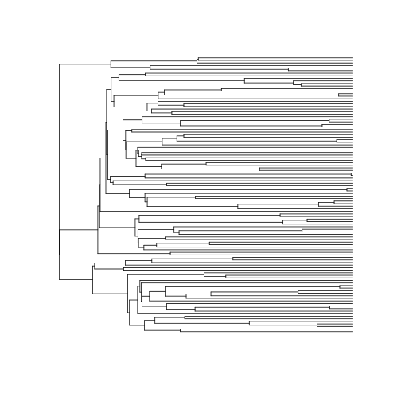
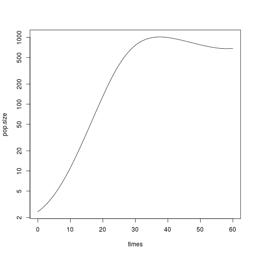
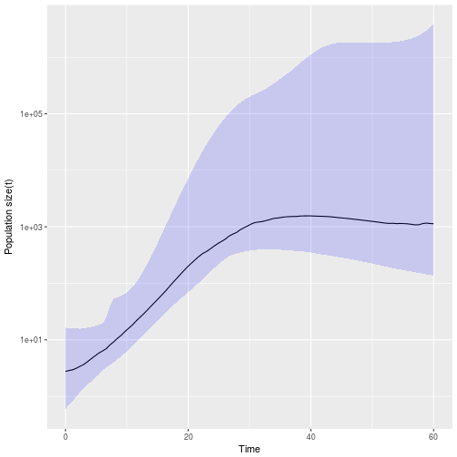
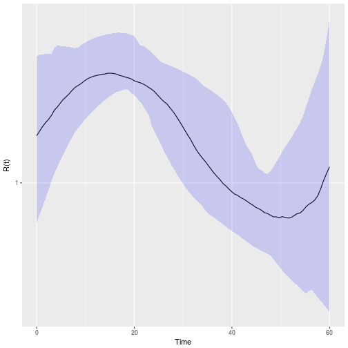
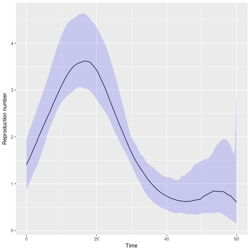
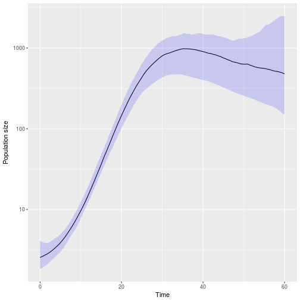

# skyspline

Phylodynamic inference using birth-rate splines. 

This package includes functions for semi-parametric inference of population size and reproduction numbers through time. Methods include
* MLE/MAP
* Parametric bootstrap
* Bayesian MCMC 

The data should take the form of a time-scaled phylogeny or multiple phylogenies. For estimation of birth-rates, it is important to also have prior knowledge of the death or removal rate. This can be a fixed value or it can be specified as a prior distribution. 

## To cite 
Erik Volz, Ethan Romero-Severson, and Thomas Leitner, [Phylodynamic inference across epidemic scales](https://doi.org/10.1093/molbev/msx077), Molecular Biology and Evolution, 2017

# Example usage

We demonstrate skysplines using a simulated genealogy from a stochastic HIV epidemic model. Each sampled lineage represents a single sampled patient who were sampled with 10% probability after 60 years. 


## Maximum likelihood
Load the tree

```r
require(skyspline)
(tre <- readRDS( system.file( 'extdata', 'demo.skyspline.hiv0.bdt.rds', package='skyspline') ))
```

```
## 
## Phylogenetic tree with 108 tips and 107 internal nodes.
## 
## Tip labels:
## 	15138_2, 13989_2, 11368_2, 14459_2, 14333_2, 14959_2, ...
## 
## Rooted; includes branch lengths.
```
Let's see what it looks like

```r
plot( tre , show.tip =F)
```



We must have some prior knowledge about HIV death rates. Suppose the following: 

```r
GAMMA <- 1/10 
```
e.g. the infectious period lasts 10 years on average. 

Fitting my maximum likelihood is accomplished using the following

```r
fit <- fit.skyspline.ml( tre 
  , death_rate_guess = GAMMA
  , R0guess = 2
)
```

```
## number splines points 1 rejected... incrementing...
## number splines points 2 rejected... incrementing...
## number splines points 3 rejected... incrementing...
## Number of spline points: 
## [1] 4
```

```r
with( fit$demo.history, plot( times, pop.size, log = 'y', type = 'l' ))
```


Note that we can also fit by maximimum a posteriori by specifing a list of priors for `R0` or `death_rate` or `lny0` (the initial log population size). If a prior is specified for `death_rate`, then that parameter will also be estimated, such as in the following:
```
fit <- fit.skyspline.ml( tre 
  , death_rate_guess = GAMMA
  , R0guess = 2
  , priors = list( death_rate = function(x) dlnorm( x, log(1/10), .5, log = T) )
)
```
Note that priors MUST return the log density. 

`fit$demo.history` provides a table describing estimated size and reproduction number through time. 

To estimate confidence intervals, we can use a parametric bootstrap approach
```
pbfit <- parboot.skyspline.mle(fit, nreps = 1e2)
```
This will take a couple minutes, so let's load the results

```r
pbfit <- readRDS( system.file( 'extdata', 'demo.skyspline.hiv0.pbfit.rds', package='skyspline') )
```

Now we can visualise the results

```r
plot.pbfit( pbfit, type = 'size' )
```



```r
plot.pbfit( pbfit, type = 'R' )
```




## Bayesian MCMC 

A simple Metropolis Hastings sampler can be used to estimate parameters by Bayesian MCMC. This requires the user to specify the standard deviation of the proposal distribution for most parameters. 
```
skyspline.metrop.hastings(
	  tre 
	  , nsteps = 1e4 
	  , sd_prop_lnR = log(3)/5 # scale for mvnorm proposal of R
	  , sd_prop_logDeathRate = abs(log(GAMMA))/5 
	  , sd_prop_lny0 = 1/4
	  , start_lnR = log(2)
	  , start_log_deathRate = log( GAMMA ) # user must define
	  , start_log_Ne = log(2) # user must define 
	  , start_log_y0 = log(1)
	  , death_rate_logprior = function(x) dlnorm( x, log(1/8), .5, log=T) 
	  , R0_logprior = function(x) dlnorm(x, log(2), 1, log=T)
	  , y0_logprior = function(x) dexp(x, rate=1, log = T)
	  , numberSplinePoints = 5
	  , thin = 10
) -> fitmh
```
This takes a while, so load the results:

```r
fitmh <- readRDS( system.file( 'extdata', 'demo.skyspline.hiv0.omh.rds', package='skyspline') )
```

`fitmh$theta` contains a trace of the Markov chain. We can visualise the results using the following.
For these plotting functions, we must specify the start and end points of the time axis. 

```r
plot.mcmc.R.t( fitmh, t0=0, t1=60 )
```



```r
plot.mcmc.population.size( fitmh , t0=0, t1=60 )
```



Note that in this example, the Markov chain was very short and effective sample sizes were low. 
Differences between this Bayesian fit and the parametric bootstrap are due both to the priors and that the Bayesian fit is not converged. You can use diagnostic tools like `effectiveSize` in the `coda` package. 


# Alternative coalescent models
A 'multi-scale' coalescent model is also included in this package, which allows you to estimate or specify a within-host effective population size. 
To use this model, specify `cotype='mscom'` in the fitting functions. 


# Citation

Please cite
* E. Volz, Romero-Severson ERS, and Leitner TK, 'Phylodynamic inference across epidemic scales', in review 2016

Please contact the authors to request this paper, which also describes the simulated data set and multi-scale coalescent model.
